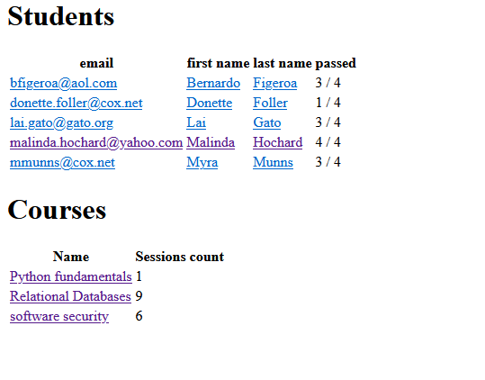

## Requirements

Set up the h2 database, Flask, jaydebeapi (connection to the database), matplotlib (generating charts)

### How to install

```bash
pip install Flask
pip install JayDeBeApi==1.2.3
pip install matplotlib
```

## How to start
    
1. Put the url and path_to_h2_jar in the files `src/url_file` and `src/path_to_h2_file`

2. Start server

```bash
python server.py
```

3. To visit the website, go to the ip, which program wrote

an example of ip:

``` 
127.0.0.1:5000/
```

4. Enter username and password (by default username: «sa», password: «»)

## How it works

When you enter username and password, it checks what you entered and connects to the database. If username and password are correct it  redirects you to the welcome page.

File server.py uses Flask to get data from url, then server.py send this data to dbreq.py. This file executes sql queries with url parameters from folder «sql scripts». When dbreq.py retrieves data from db, dbreq.py sends it to the «server.py», which renders template with this retrieved data from database.

### How charts are generated

If data from file `site/static/data_for_first_chart` or `site/static/data_for_second_chart` differs from sql queries, new charts are generated using `generate_charts.py` and the time of generating of this new charts is set in file `site/static/last time generated`.
`site/static/last time generated` is used in welcome page to show last time the charts were generated.

### How grades are calculeted

Just takes average of all grades for a course. If avg is grater then 10, the course is counted as passed.

## Something strange


As you see there are only 3 courses but 4 final grades, this happens if there was course with no sessions, so it is not an error.
